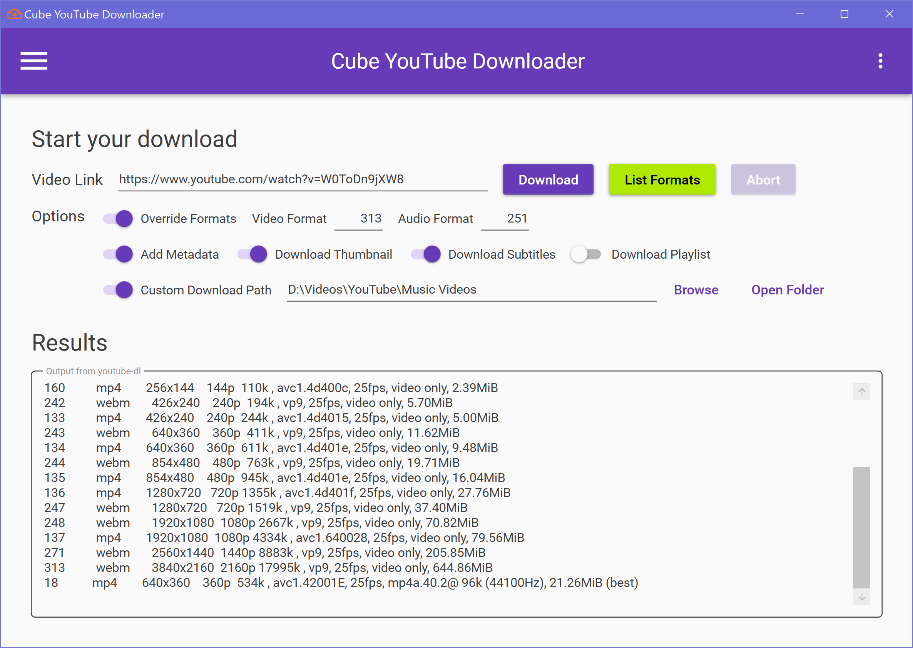
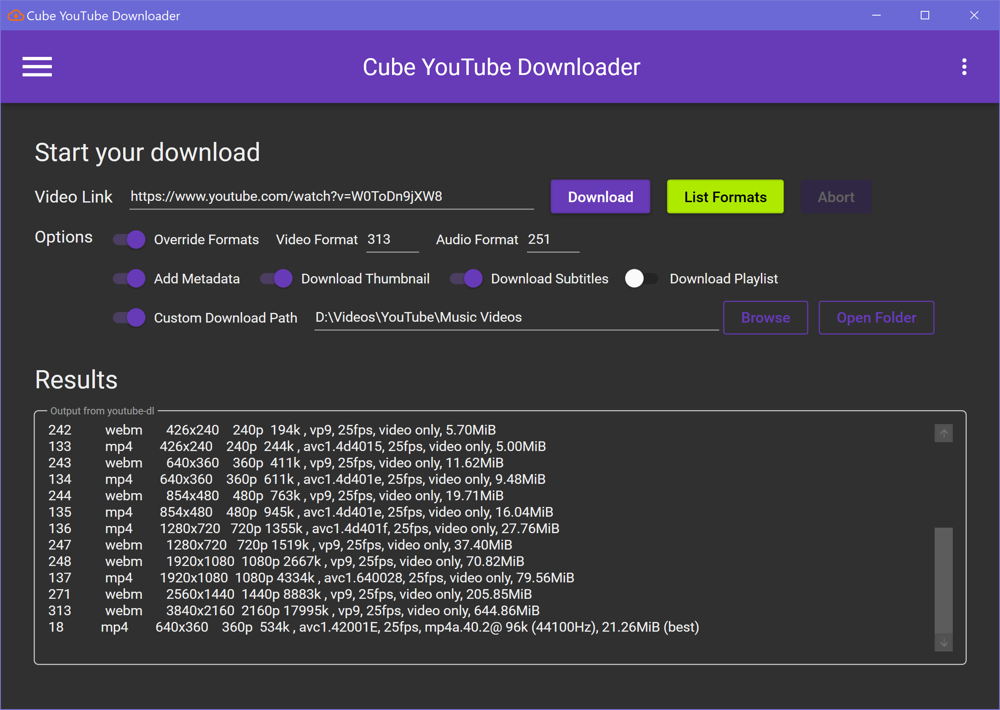

# 🎞⬇ Cube YouTube Downloader - `youtube-dl-wpf`

A simple GUI wrapper for [`youtube-dl`](https://github.com/ytdl-org/youtube-dl).

## Features

- Toggle 🌃 Dark Mode and 🔆 Light Mode.
- Update `youtube-dl` on startup.
- List available formats.
- Override video and audio formats.
- Toggle metadata embedding.
- Toggle thumbnail and subtitles embedding.
- Custom `ffmpeg` and `youtube-dl` path.
- Custom proxy support.

## Known Issues

- Setting `youtube-dl` path won't update button status.

## To-Do

- Re-implement AppSettings using Event Aggregators.

## License

`youtube-dl-wpf` is licensed under [GPLv3](LICENSE).

[`youtube-dl`](https://github.com/ytdl-org/youtube-dl) is licensed under [The Unlicense](https://github.com/ytdl-org/youtube-dl/blob/master/LICENSE).
