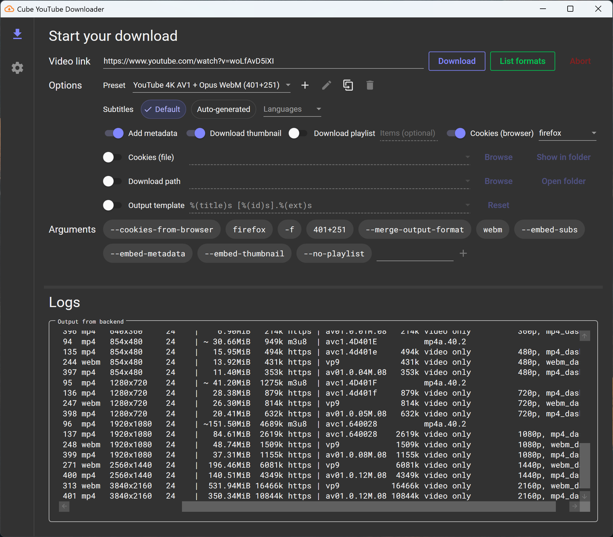
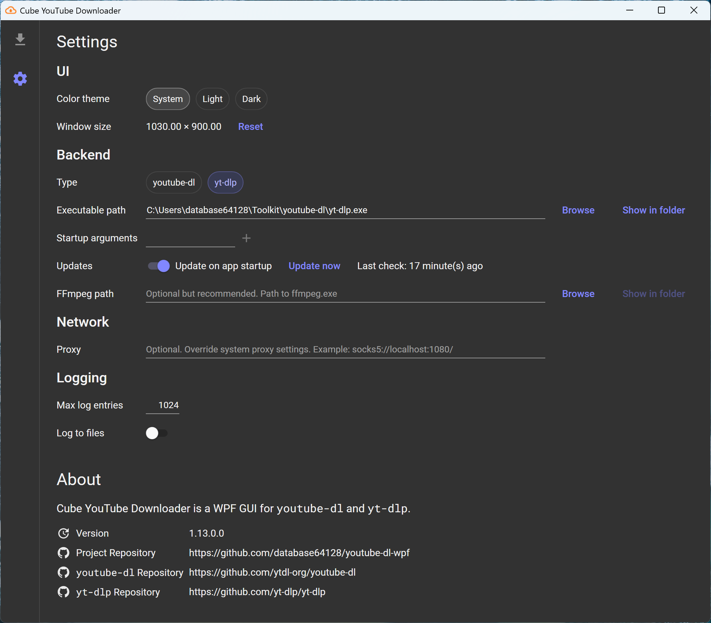

# 🎞⬇ Cube YouTube Downloader - `youtube-dl-wpf`

[](https://github.com/database64128/youtube-dl-wpf/actions/workflows/build.yml)
[](https://github.com/database64128/youtube-dl-wpf/actions/workflows/release.yml)

WPF GUI for [youtube-dl](https://github.com/ytdl-org/youtube-dl) and [yt-dlp](https://github.com/yt-dlp/yt-dlp).




## Features

- Follow 🎨 system color mode, or choose between 🌃 dark mode and 🔆 light mode.
- Update youtube-dl/yt-dlp on startup.
- List all available formats.
- Override video, audio formats and output container.
- Embed metadata into downloaded file.
- Download and embed thumbnails.
- Download whole playlists.
- Select items from playlist to download.
- Select types of subtitles (default, all languages, auto-generated) to download and embed.
- Specify custom output template.
- Specify custom download path.
- Specify custom FFmpeg path.
- Specify custom proxy.
- Specify custom command-line arguments.

## Usage

1. Download the pre-built binary or build it from source.
2. Download [yt-dlp](https://github.com/yt-dlp/yt-dlp) or [youtube-dl](https://github.com/ytdl-org/youtube-dl).
3. It's optional but highly recommended to also download [FFmpeg](https://ffmpeg.org/download.html). Otherwise you won't be able to merge separate video and audio tracks.
4. The framework-dependent binary requires an installed [.NET Runtime](https://dotnet.microsoft.com/) to run. Alternatively, download the self-contained binary that bundles the runtime.
5. Run `youtube-dl-wpf.exe`. Go to __Settings__. Set the path to youtube-dl/yt-dlp and FFmpeg.
6. Go back to the home tab. Paste a video URL and start downloading! 🚀

## FAQ

1.  Q: The __Download__ button is grayed out and I can't click it!

    A: `youtube-dl-wpf` is a simple GUI wrapper. It doesn't bundle any downloader with it. You have to download youtube-dl or yt-dlp for it to work. FFmpeg is required by youtube-dl and yt-dlp when merging separate video and audio tracks, which is the case for most formats on YouTube.

2.  Q: How can I use a proxy to download?

    A: Leave the proxy field empty to use system proxy settings. Otherwise the format is similar to how `curl` accepts proxy strings (e.g. `socks5://localhost:1080/`, `http://localhost:8080/`). Currently the upstream doesn't accept `socks5h` protocol and treat `socks5` as `socks5h` by always resolving the hostname using the proxy. This is tracked in [this issue](https://github.com/ytdl-org/youtube-dl/issues/22618).

3.  Q: Downloading the whole playlist doesn't work!

    A: It's an upstream bug, just like many other issues you might discover. There's nothing I can do. Just report the bug to yt-dlp or youtube-dl, whichever you use.

4.  Q: `youtube-dl` and `yt-dlp` behave differently!

    A: In some cases, yes, and `youtube-dl-wpf` tries to align their behavior by sending different options and arguments for different backends. See the [backends documentation](Backends.md) for more information.

## Known Issues

- 🎉 No known issues!

## To-Do

- [ ] v2.0 - The Parallel Update: download management and download queue for parallel downloads.

## Build

Prerequisites: .NET 8 SDK

Note for packagers: The application by default uses executable directory as config directory. To use user's config directory, define the constant `PACKAGED` when building.

###  Build with Release configuration

```bash
dotnet build -c Release
```

### Publish as framework-dependent

```bash
dotnet publish YoutubeDl.Wpf -c Release
```

### Publish as self-contained for Windows x64

```bash
dotnet publish YoutubeDl.Wpf -c Release -r win-x64 --self-contained
```

### Publish as self-contained for packaging on Windows x64

```bash
dotnet publish YoutubeDl.Wpf -c Release -p:DefineConstants=PACKAGED -r win-x64 --self-contained
```

## License

- This project is licensed under [GPLv3](LICENSE).
- The icons are from [Material Design Icons](https://materialdesignicons.com/) and are licensed under the [Pictogrammers Free License](https://dev.materialdesignicons.com/license).
- [`youtube-dl`](https://github.com/ytdl-org/youtube-dl) and [`yt-dlp`](https://github.com/yt-dlp/yt-dlp) are licensed under [The Unlicense](https://github.com/ytdl-org/youtube-dl/blob/master/LICENSE).
- [Material Design Themes](https://github.com/MaterialDesignInXAML/MaterialDesignInXamlToolkit) is licensed under [MIT](https://github.com/MaterialDesignInXAML/MaterialDesignInXamlToolkit/blob/master/LICENSE).
- [Roboto Mono](https://fonts.google.com/specimen/Roboto+Mono) is licensed under the [Apache License, Version 2.0](https://www.apache.org/licenses/LICENSE-2.0).
- [ReactiveUI](https://github.com/reactiveui/ReactiveUI) and its dependencies are licensed under [MIT](https://github.com/reactiveui/ReactiveUI/blob/main/LICENSE).

© 2024 database64128
